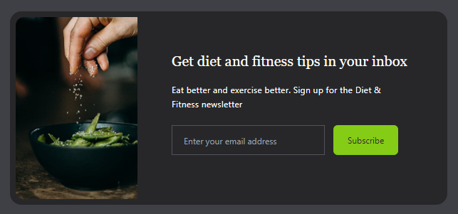

# Email Subscribe

## Overview

This project is a simple email subscription page using HTML and TailwindCSS. It displays a beautifully designed subscription form for diet and fitness tips newsletter.

## Structure

The project consists of a single HTML file, showcasing a form with an email input field and a subscribe button. The page also includes a relevant image on the left and a short description about the newsletter.

## Technologies

- **HTML5**: Markup language used for structuring the page.
- [**TailwindCSS**](https://tailwindcss.com/): A utility-first CSS framework used for styling the page. It's included via a CDN link in the HTML file.

## Setup

To get this project up and running, follow these steps:

1. Clone or download the repository.
2. Open the HTML file in your web browser.

**Note:** You might need to replace `images/image.jpg` with the actual path to the image in your project directory.

## Features

- **Responsive Design**: The webpage is designed to be responsive and can adapt to different screen sizes.
- **Modern Look**: With TailwindCSS, the webpage looks modern and stylish.
- **Hover Effects**: The image on the left has a scaling effect when hovered over.

## Future Improvements

Future updates can include backend integration to actually receive and store the emails from users.

## Contributing

Feel free to fork this project, make changes, submit pull requests, and send suggestions!

## License

This project is open-source and available to everyone under the [MIT License](https://mit-license.org/).
